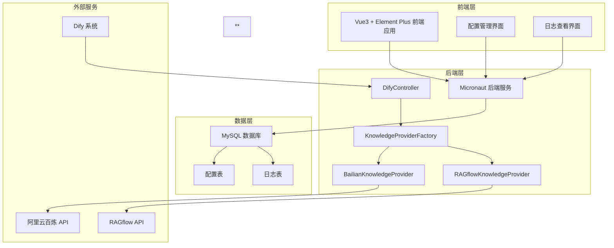
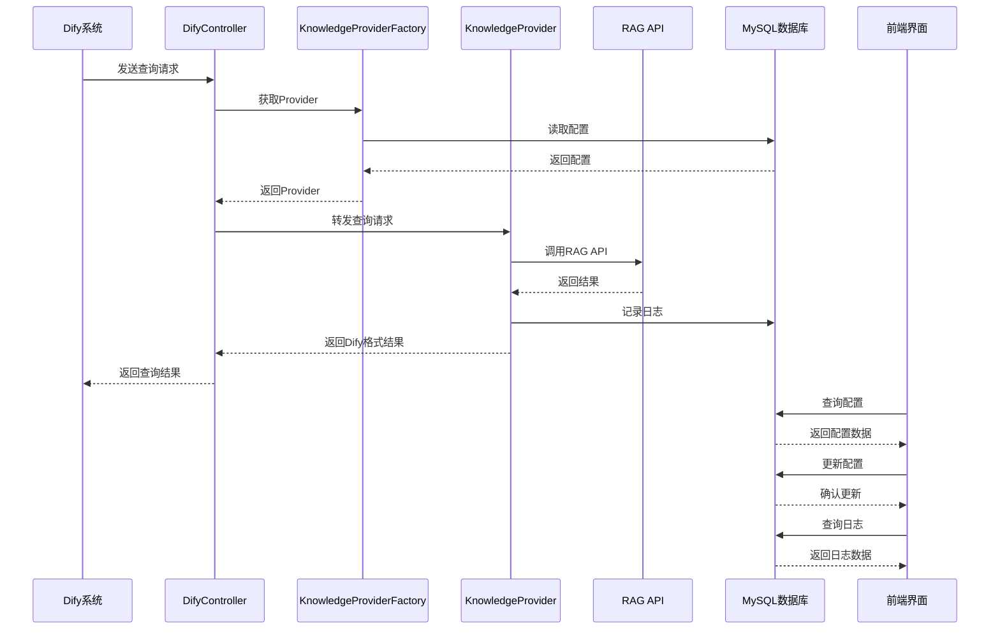
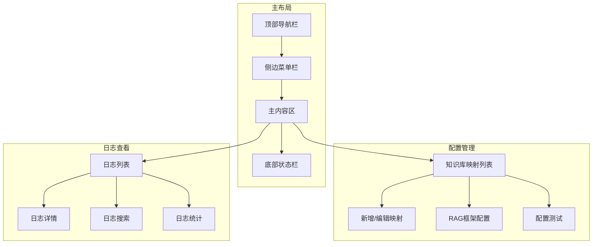
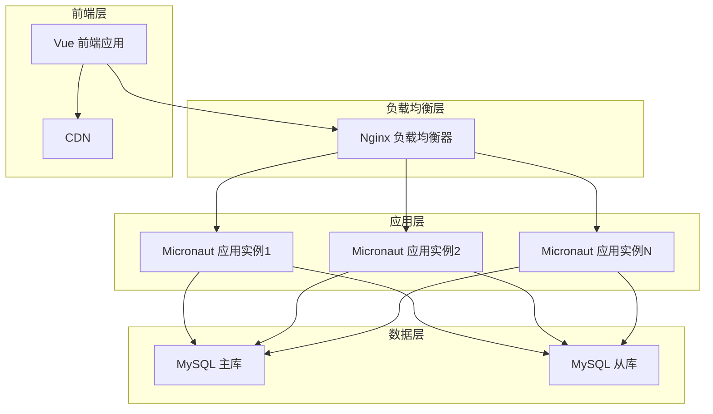

# dify-external-knowledge-api 设计文档for Agentic

本项目（dify-external-knowledge-api）是一个用于Dify的外部知识API转发服务，旨在为Dify提供一个可扩展的外部知识库转发接口。快速将外部知识库数据集成到Dify中，实现知识库的扩展。

## 主要功能

1. 通过此服务，可以根据dify的API接口规范，将dify发起的外部知识库请求，转发到不同的RAG框架提供的知识库API中，例如阿里云百炼、RAGflow等
2. 提供一个基于element3、vue3、js、使用pnpm作为包管理的前端页面，用户可以进行接口转发相关配置。**所有核心配置（包括bailian配置、ragflow配置、Dify知识库对应关系）完全存储在MySQL数据库中，通过前端可视化界面进行管理**
3. 支持实时日志查看和统计分析功能

## 系统架构图



## 数据流图



## 后端架构设计

### 技术栈
- **框架**: Micronaut 4.7.6
- **数据库**: MySQL 8.0+
- **日志**: SLF4J + Logback
- **HTTP客户端**: Micronaut HTTP Client
- **响应式编程**: Reactor
- **序列化**: Jackson

### 核心组件

#### 1. 知识库提供者接口 (KnowledgeProvider)
```java
public interface KnowledgeProvider {
    String getProviderName();
    Mono<DifyQueryResponse> query(DifyQueryEntity queryEntity);
}
```

#### 2. 知识库提供者工厂 (KnowledgeProviderFactory)
- 使用策略模式管理不同的RAG框架API提供者
- 通过依赖注入自动发现和注册所有提供者实现
- 根据knowledge_id动态选择合适的提供者

#### 3. 控制器 (DifyController)
- 接收Dify系统的查询请求
- 转发请求到对应的知识库提供者
- 统一异常处理和错误响应

#### 4. 数据库集成
- 从H2内存数据库迁移到MySQL数据库
- 使用Micronaut Data JDBC进行数据访问
- **所有核心配置完全存储在数据库中，不再依赖配置文件**
- 支持配置和日志的持久化存储

#### 5. 日志系统
- 记录所有API请求和响应
- 支持结构化日志存储
- 提供日志查询和分析功能

#### 6. 配置管理机制
- **配置完全数据库化**：bailian配置、ragflow配置、Dify知识库对应关系全部存储在数据库
- **动态配置加载**：应用启动时从数据库加载配置，支持运行时配置更新
- **配置缓存**：使用本地缓存提高配置访问性能，配置变更时自动刷新缓存
- **配置验证**：前端和后端双重验证，确保配置的正确性和完整性

### 配置管理

#### 应用配置 (application.yml)
```yaml
micronaut:
  application:
    name: dify-api
  server:
    cors:
      enabled: true

datasources:
  default:
    url: jdbc:mysql://localhost:3306/dify_knowledge
    username: ${DB_USER:root}
    password: ${DB_PASSWORD:password}
    driver-class-name: com.mysql.cj.jdbc.Driver

# 注意：所有RAG框架相关配置已移至数据库，此处仅保留基础应用配置
```

#### 配置加载机制
```java
@Singleton
public class DatabaseConfigService {
    private final KnowledgeMappingRepository mappingRepository;
    private final RagConfigRepository ragConfigRepository;
    private final Cache<String, Object> configCache;
    
    @PostConstruct
    public void initialize() {
        loadAllConfigs();
    }
    
    public void refreshCache() {
        configCache.clear();
        loadAllConfigs();
    }
    
    private void loadAllConfigs() {
        // 从数据库加载所有配置并缓存
    }
}
```

## 前端架构设计

### 技术栈
- **框架**: Vue 3
- **UI组件库**: Element Plus
- **构建工具**: Vite
- **包管理**: pnpm
- **HTTP客户端**: Axios

### 核心功能模块

#### 1. 配置管理界面
- **知识库映射配置**：可视化配置Dify知识库ID与RAG框架的映射关系
- **RAG框架API配置**：可视化配置各RAG框架的API端点、密钥和参数
- **实时配置测试**：配置完成后可立即测试连接和查询功能
- **配置导入导出**：支持配置的批量导入导出，便于环境迁移
- **配置版本管理**：记录配置变更历史，支持配置回滚
- **配置状态监控**：实时显示各配置的连接状态和健康检查结果

#### 2. 日志查看界面
- 实时日志流式展示
- 日志搜索和过滤
- 日志统计分析
- 日志导出功能

#### 3. 页面布局


## 数据库设计

### 1. 知识库映射表 (knowledge_mapping)
```sql
CREATE TABLE knowledge_mapping (
    id BIGINT PRIMARY KEY AUTO_INCREMENT,
    knowledge_id VARCHAR(100) NOT NULL COMMENT 'Dify知识库ID',
    provider_type VARCHAR(50) NOT NULL COMMENT '提供者类型: bailian, ragflow',
    target_id VARCHAR(255) NOT NULL COMMENT '目标系统中的知识库ID',
    workspace_id VARCHAR(255) COMMENT '工作空间ID(百炼专用)',
    config_params TEXT COMMENT '额外配置参数(JSON格式)',
    status TINYINT DEFAULT 1 COMMENT '状态: 0-禁用, 1-启用',
    created_at TIMESTAMP DEFAULT CURRENT_TIMESTAMP,
    updated_at TIMESTAMP DEFAULT CURRENT_TIMESTAMP ON UPDATE CURRENT_TIMESTAMP,
    UNIQUE KEY uk_knowledge_id (knowledge_id),
    INDEX idx_provider_type (provider_type),
    INDEX idx_status (status)
) COMMENT '知识库映射表';
```

### 2. RAG框架配置表 (rag_config)
```sql
CREATE TABLE rag_config (
    id BIGINT PRIMARY KEY AUTO_INCREMENT,
    provider_type VARCHAR(50) NOT NULL COMMENT '提供者类型: bailian, ragflow',
    endpoint VARCHAR(500) NOT NULL COMMENT 'API端点',
    api_key VARCHAR(500) NOT NULL COMMENT 'API密钥',
    config_params TEXT COMMENT '配置参数(JSON格式)',
    status TINYINT DEFAULT 1 COMMENT '状态: 0-禁用, 1-启用',
    created_at TIMESTAMP DEFAULT CURRENT_TIMESTAMP,
    updated_at TIMESTAMP DEFAULT CURRENT_TIMESTAMP ON UPDATE CURRENT_TIMESTAMP,
    UNIQUE KEY uk_provider_type (provider_type),
    INDEX idx_status (status)
) COMMENT 'RAG框架配置表';
```

### 3. 配置变更历史表 (config_history)
```sql
CREATE TABLE config_history (
    id BIGINT PRIMARY KEY AUTO_INCREMENT,
    config_type VARCHAR(50) NOT NULL COMMENT '配置类型: mapping, rag_config',
    config_id BIGINT NOT NULL COMMENT '配置ID',
    operation_type VARCHAR(20) NOT NULL COMMENT '操作类型: CREATE, UPDATE, DELETE',
    old_value TEXT COMMENT '旧值(JSON格式)',
    new_value TEXT COMMENT '新值(JSON格式)',
    operator VARCHAR(100) COMMENT '操作人',
    created_at TIMESTAMP DEFAULT CURRENT_TIMESTAMP,
    INDEX idx_config_type_id (config_type, config_id),
    INDEX idx_created_at (created_at)
) COMMENT '配置变更历史表';
```

### 3. API日志表 (api_log)
```sql
CREATE TABLE api_log (
    id BIGINT PRIMARY KEY AUTO_INCREMENT,
    request_id VARCHAR(100) NOT NULL COMMENT '请求ID',
    knowledge_id VARCHAR(100) COMMENT '知识库ID',
    provider_type VARCHAR(50) COMMENT '提供者类型',
    request_url VARCHAR(500) COMMENT '请求URL',
    request_method VARCHAR(10) COMMENT '请求方法',
    request_headers TEXT COMMENT '请求头',
    request_body TEXT COMMENT '请求体',
    response_status INT COMMENT '响应状态码',
    response_headers TEXT COMMENT '响应头',
    response_body TEXT COMMENT '响应体',
    response_time BIGINT COMMENT '响应时间(ms)',
    error_message TEXT COMMENT '错误信息',
    created_at TIMESTAMP DEFAULT CURRENT_TIMESTAMP,
    INDEX idx_knowledge_id (knowledge_id),
    INDEX idx_provider_type (provider_type),
    INDEX idx_created_at (created_at)
) COMMENT 'API日志表';
```

## API接口规范

### 1. Dify查询接口
```
POST /dify/retrieval
Content-Type: application/json

{
  "knowledge_id": "bailian-kb",
  "query": "查询内容",
  "retrieval_setting": {
    "top_k": 5,
    "score_threshold": 0.7
  },
  "metadata_condition": {
    "logical_operator": "AND",
    "conditions": [...]
  }
}
```

### 2. 配置管理接口

#### 2.1 获取知识库映射列表
```
GET /api/config/mappings
Response:
{
  "code": 0,
  "message": "success",
  "data": [
    {
      "id": 1,
      "knowledge_id": "bailian-kb",
      "provider_type": "bailian",
      "target_id": "your-bailian-app-id",
      "workspace_id": "llm-j62ei2m0ij16xwhk",
      "config_params": {},
      "status": 1,
      "created_at": "2024-01-01T00:00:00Z",
      "updated_at": "2024-01-01T00:00:00Z"
    }
  ]
}
```

#### 2.2 创建知识库映射
```
POST /api/config/mappings
Content-Type: application/json

{
  "knowledge_id": "new-kb",
  "provider_type": "ragflow",
  "target_id": "your-ragflow-app-id",
  "workspace_id": "",
  "config_params": {},
  "status": 1
}
```

#### 2.3 更新知识库映射
```
PUT /api/config/mappings/{id}
Content-Type: application/json

{
  "knowledge_id": "updated-kb",
  "provider_type": "ragflow",
  "target_id": "updated-ragflow-app-id",
  "workspace_id": "",
  "config_params": {},
  "status": 1
}
```

#### 2.4 删除知识库映射
```
DELETE /api/config/mappings/{id}
```

#### 2.5 获取RAG框架配置
```
GET /api/config/rag/{provider_type}
Response:
{
  "code": 0,
  "message": "success",
  "data": {
    "id": 1,
    "provider_type": "bailian",
    "endpoint": "https://bailian.aliyuncs.com/v2/app/completions",
    "api_key": "sk-***",
    "config_params": {
      "sparseSimilarityTopK": 100,
      "denseSimilarityTopK": 100,
      "enableReranking": true,
      "rerankMinScore": 0.7,
      "rerankTopN": 5
    },
    "status": 1,
    "created_at": "2024-01-01T00:00:00Z",
    "updated_at": "2024-01-01T00:00:00Z"
  }
}
```

#### 2.6 更新RAG框架配置
```
PUT /api/config/rag/{provider_type}
Content-Type: application/json

{
  "endpoint": "https://bailian.aliyuncs.com/v2/app/completions",
  "api_key": "sk-updated-key",
  "config_params": {
    "sparseSimilarityTopK": 100,
    "denseSimilarityTopK": 100,
    "enableReranking": true,
    "rerankMinScore": 0.7,
    "rerankTopN": 5
  },
  "status": 1
}
```

#### 2.7 测试RAG框架配置
```
POST /api/config/rag/{provider_type}/test
Content-Type: application/json

{
  "test_query": "测试查询内容",
  "test_knowledge_id": "test-kb-id"
}
Response:
{
  "code": 0,
  "message": "success",
  "data": {
    "success": true,
    "response_time": 1500,
    "result_count": 5,
    "error_message": null
  }
}
```

#### 2.8 获取配置变更历史
```
GET /api/config/history?config_type=mapping&config_id=1&page=1&size=20
Response:
{
  "code": 0,
  "message": "success",
  "data": {
    "total": 10,
    "page": 1,
    "size": 20,
    "records": [
      {
        "id": 1,
        "config_type": "mapping",
        "config_id": 1,
        "operation_type": "UPDATE",
        "old_value": {...},
        "new_value": {...},
        "operator": "admin",
        "created_at": "2024-01-01T00:00:00Z"
      }
    ]
  }
}
```

#### 2.9 配置回滚
```
POST /api/config/rollback
Content-Type: application/json

{
  "config_type": "mapping",
  "config_id": 1,
  "history_id": 5
}
Response:
{
  "code": 0,
  "message": "success",
  "data": {
    "success": true,
    "message": "配置已成功回滚到指定版本"
  }
}
```

#### 2.10 批量导入配置
```
POST /api/config/import
Content-Type: multipart/form-data

file: config.json
Response:
{
  "code": 0,
  "message": "success",
  "data": {
    "success_count": 10,
    "failed_count": 2,
    "errors": [
      {
        "line": 5,
        "error": "知识库ID已存在"
      }
    ]
  }
}
```

#### 2.11 批量导出配置
```
GET /api/config/export?format=json
Response:
Content-Type: application/json
Content-Disposition: attachment; filename="config_export_20240101.json"

{
  "mappings": [...],
  "rag_configs": [...],
  "export_time": "2024-01-01T00:00:00Z"
}
```

### 3. 日志管理接口

#### 3.1 获取日志列表
```
GET /api/logs?page=1&size=20&knowledge_id=bailian-kb&provider_type=bailian&start_date=2024-01-01&end_date=2024-01-31
Response:
{
  "code": 0,
  "message": "success",
  "data": {
    "total": 100,
    "page": 1,
    "size": 20,
    "records": [
      {
        "id": 1,
        "request_id": "req-123",
        "knowledge_id": "bailian-kb",
        "provider_type": "bailian",
        "request_url": "https://bailian.aliyuncs.com/v2/app/completions",
        "request_method": "POST",
        "request_body": "{...}",
        "response_status": 200,
        "response_body": "{...}",
        "response_time": 1500,
        "error_message": null,
        "created_at": "2024-01-01T00:00:00Z"
      }
    ]
  }
}
```

#### 3.2 获取日志详情
```
GET /api/logs/{id}
Response:
{
  "code": 0,
  "message": "success",
  "data": {
    "id": 1,
    "request_id": "req-123",
    "knowledge_id": "bailian-kb",
    "provider_type": "bailian",
    "request_url": "https://bailian.aliyuncs.com/v2/app/completions",
    "request_method": "POST",
    "request_headers": "{...}",
    "request_body": "{...}",
    "response_status": 200,
    "response_headers": "{...}",
    "response_body": "{...}",
    "response_time": 1500,
    "error_message": null,
    "created_at": "2024-01-01T00:00:00Z"
  }
}
```

#### 3.3 获取日志统计
```
GET /api/logs/stats?start_date=2024-01-01&end_date=2024-01-31
Response:
{
  "code": 0,
  "message": "success",
  "data": {
    "total_requests": 1000,
    "success_rate": 95.5,
    "avg_response_time": 1200,
    "provider_stats": [
      {
        "provider_type": "bailian",
        "request_count": 600,
        "success_rate": 96.0,
        "avg_response_time": 1100
      },
      {
        "provider_type": "ragflow",
        "request_count": 400,
        "success_rate": 94.8,
        "avg_response_time": 1300
      }
    ],
    "daily_stats": [
      {
        "date": "2024-01-01",
        "request_count": 50,
        "success_rate": 94.0,
        "avg_response_time": 1150
      }
    ]
  }
}
```

## 详细功能设计说明

### 1. 接口转发配置

#### 1.1 知识库映射配置
- **知识库ID**: 决定了当dify请求发送至此接口时，将转发至哪个RAG框架API
- **提供者类型**: 支持的RAG框架类型，如bailian、ragflow等
- **目标ID**: 在RAG框架中的知识库ID
- **工作空间ID**: 特定于某些提供者的额外标识（如百炼）
- **配置参数**: 额外的配置参数，以JSON格式存储
- **配置状态**: 支持启用/禁用配置，便于临时停用某些映射

#### 1.2 RAG框架配置管理
- **API端点配置**: 每个RAG框架的API地址和认证信息
- **参数配置**: 各框架特有的参数，如top_k、score_threshold等
- **连接测试**: 配置完成后可立即测试连接和查询功能
- **健康检查**: 定期检查各RAG框架的可用性

#### 1.3 配置生命周期管理
- **配置版本控制**: 记录所有配置变更历史，支持版本对比和回滚
- **配置导入导出**: 支持配置的批量导入导出，便于环境迁移和备份
- **配置审计**: 记录所有配置操作的详细日志，包括操作人、时间、变更内容

#### 1.4 参数映射规则
- **Dify请求参数转发**: 对于dify的请求中携带的配置，例如top_k、score_threshold，如果对应的RAG框架API支持这些配置，则直接转发
- **RAG框架特有参数**: 对于dify的请求中不存在的配置，但存在于RAG框架API中的配置，这些值都要在前端页面中支持配置
- **Dify特有参数**: 对于RAG框架API中不存在的配置，但dify的请求中存在的配置，这些值不需要配置
- **响应格式统一**: 对于各个RAG框架API的响应，都统一转换成dify的响应格式，确保dify可以直接使用

#### 1.5 配置加载机制
- **启动时加载**: 应用启动时从数据库加载所有配置到内存缓存
- **动态更新**: 支持运行时配置更新，无需重启应用
- **缓存刷新**: 配置变更时自动刷新相关缓存，确保配置及时生效
- **降级处理**: 当数据库不可用时，使用本地缓存配置继续提供服务

### 2. 日志配置

#### 2.1 日志记录内容
- **请求信息**: URL、请求方法、请求头、请求体
- **响应信息**: 状态码、响应头、响应体
- **性能指标**: 响应时间
- **错误信息**: 错误详情（如果有）

#### 2.2 日志存储
- **数据库存储**: 使用MySQL数据库存储日志记录，便于后续查询和分析
- **索引优化**: 为常用查询字段创建索引，提高查询性能
- **数据生命周期**: 可配置日志保留期限，定期清理过期日志

#### 2.3 日志展示
- **流式展示**: 通过前端页面实时展示日志流
- **搜索过滤**: 支持按知识库ID、提供者类型、时间范围等条件进行搜索和过滤
- **统计分析**: 提供请求量、成功率、响应时间等统计指标的图表展示

## 部署方案

### 1. 环境要求
- **Java**: 17+
- **MySQL**: 8.0+
- **Node.js**: 16+ (用于前端构建)

### 2. 部署架构


### 3. 配置管理
- **环境变量**: 使用环境变量管理敏感配置（如API密钥）
- **配置中心**: 可选使用配置中心统一管理配置
- **配置热更新**: 支持不重启应用更新部分配置

## 扩展性设计

### 1. 新RAG框架接入
- **提供者接口**: 实现KnowledgeProvider接口即可接入新的RAG框架
- **配置管理**: 在前端配置界面添加新框架的配置项
- **参数映射**: 实现请求参数和响应格式的转换逻辑

### 2. 性能优化
- **缓存**: 对频繁查询的知识库映射和RAG框架配置进行缓存
- **连接池**: 使用HTTP连接池提高外部API调用效率
- **异步处理**: 使用响应式编程提高系统吞吐量

### 3. 监控告警
- **健康检查**: 提供应用健康检查接口
- **指标监控**: 集成Prometheus监控关键指标
- **日志聚合**: 使用ELK或类似方案聚合和分析日志

## 安全设计

### 1. 认证授权
- **API密钥**: 对外提供API的密钥认证
- **权限控制**: 基于角色的访问控制（RBAC）
- **CORS配置**: 合理配置跨域访问策略

### 2. 数据安全
- **敏感信息**: API密钥等敏感信息加密存储
- **数据传输**: 使用HTTPS加密传输
- **输入验证**: 对所有输入进行严格验证

### 3. 审计日志
- **操作审计**: 记录所有配置变更操作
- **访问审计**: 记录敏感数据的访问
- **安全事件**: 记录安全相关事件

## 测试策略

### 1. 单元测试
- **核心逻辑**: 对核心业务逻辑进行单元测试
- **边界条件**: 测试各种边界条件和异常情况
- **Mock外部依赖**: 使用Mock对象隔离外部依赖

### 2. 集成测试
- **API测试**: 测试所有API接口的正确性
- **数据库测试**: 测试数据库操作的正确性
- **端到端测试**: 模拟完整业务流程进行测试

### 3. 性能测试
- **负载测试**: 测试系统在高负载下的表现
- **压力测试**: 测试系统的极限承载能力
- **稳定性测试**: 长时间运行测试系统稳定性

## 配置完全数据库化架构优势

### 1. 灵活性提升
- **动态配置**: 无需重启应用即可修改配置，提高系统灵活性
- **多环境管理**: 通过数据库可以轻松管理开发、测试、生产等多套环境配置
- **配置版本控制**: 支持配置版本管理和回滚，降低配置变更风险

### 2. 可维护性增强
- **集中管理**: 所有配置集中存储在数据库中，便于统一管理和监控
- **配置审计**: 完整记录配置变更历史，便于问题追踪和合规审计
- **可视化操作**: 通过前端界面进行配置管理，降低操作门槛

### 3. 可靠性保障
- **配置备份**: 支持配置的批量导入导出，便于数据备份和恢复
- **降级机制**: 当数据库不可用时，使用本地缓存配置继续提供服务
- **配置验证**: 前后端双重验证，确保配置的正确性和完整性

### 4. 扩展性支持
- **新框架接入**: 接入新的RAG框架只需在数据库中添加配置，无需修改代码
- **参数扩展**: 通过JSON格式存储配置参数，支持灵活的参数扩展
- **功能增强**: 可以轻松添加配置测试、健康检查等增强功能

## 实施建议

### 1. 数据迁移
- **现有配置**: 将现有的配置文件内容迁移到数据库中
- **初始化脚本**: 提供数据库初始化脚本，包含必要的默认配置
- **数据验证**: 迁移后验证配置的完整性和正确性

### 2. 缓存策略
- **缓存预热**: 应用启动时预加载所有配置到缓存
- **缓存更新**: 配置变更时及时更新缓存，确保数据一致性
- **缓存降级**: 当数据库不可用时，使用缓存配置继续提供服务

### 3. 监控告警
- **配置变更监控**: 监控关键配置的变更，及时通知相关人员
- **连接状态监控**: 监控各RAG框架的连接状态，及时发现问题
- **性能监控**: 监控配置加载和缓存性能，优化系统响应时间

### 4. 安全考虑
- **权限控制**: 对配置管理操作进行权限控制，防止未授权访问
- **敏感信息**: API密钥等敏感信息在数据库中加密存储
- **操作审计**: 记录所有配置操作的详细日志，便于安全审计